# [zkEVM Bootcamp](https://www.encode.club/zksync-zkevm-bootcamp)
This repo contains my solutions to the homework assigned in the bootcamp and notes.

## Day 1
### The introduction
There were several speakers from Encode, zkSync, and Extropy. The interesting parts for me were:
1. A structured overview of the problems that crypto and blockchain solve:
- inflation
- availability of money
- crises
- centralization
- etc.
2. Detailed insights into the history of consensus mechanisms and the development of the Merge. 
We also quickly covered cryptographic basics such as the Diffie-Hellman key exchange protocol and Merkle trees.

## Day 2
### Why scalability
Laurence from Entropy made some key points about Layer 1 solutions:
- History of the classic scalability problem. This is the main problem that various L1 and L2 blockchains are trying to solve: having scalability, decentralization and security at the same time.
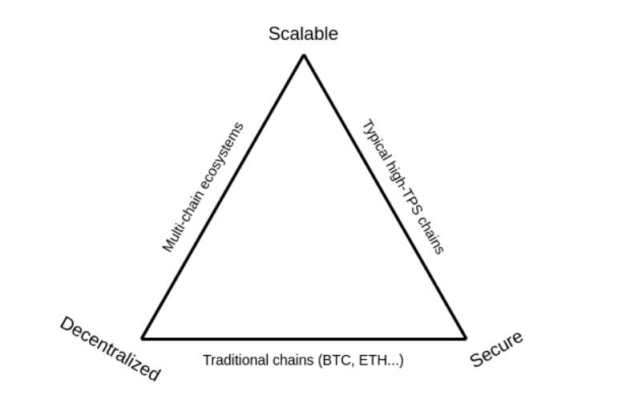
- TPS measures and marketing. Context is important when you see advertised parameters like TPS, because they vary widely in different contexts and may not be achievable in reality.
- Popular blockchains like Ethereum and Bitcoin are much slower than traditional payment systems like Visa. While it is a fact, I think blockchains theoretically have more potential than traditional systems because they have more computing power.
- Sequential and parallel transaction processing. The simplified systems with sequential ordering of transactions like Ethereum introduce problems like MEV and poor horizontal scaling. Parallel processing can solve them, but it is much more complex.
- [Sharding in Ethereum](https://vitalik.ca/general/2021/04/07/sharding.html).
- The main limitations of the TPS are CPU, bandwidth, and memory.

Layer 2 solutions can be done with different approaches:
- Plasma
- State Channels (The Lightning Network on Bitcoin)
- Sidechains
- Hybrids
- Validium
- Rollups
    - ZKP Rollups
    - Optimistic Rollups

Rollups are the most popular at the moment. They currently have some problems, such as centralized or restricted Sequencers.
ZKP rollups and optimistic rollups differ in the process of batch validation. By default, ZKP rollups don't trust any data sent to the Verifier on L1. Optimistic rollups accept all data by default, but fraud can be detected.

It's interesting how many ZKP rollups have the "ZK" part in their name, but don't actually use it. I remember videos I saw on YouTube explaining the difference between SNARKs and zk-SNARKs, and these rollups can use the primer because there's really no point in "zero-knowledge" privacy at this stage. It is just important to have a succinct proof.

Vitalik Buterin recently wrote [a very interesting article](https://vitalik.eth.limo/general/2023/11/14/neoplasma.html) about the return of Plasma L2 in light of recent improvements in our understanding of zk-proofs.

## Day 3
### Introduction to L2
I've been assigned to group number 5, which has ten members in total! At the start of the lesson, we split up into groups (but didn't do anything specific).

More about data availability and the difference between ZKP and Optimistic rollups.
As was mentioned on Day 2, ZKP rollups work on Validity Proofs, while Optimistic rollups work on Fault Proofs.

zkEVM is a VM that emulates the usual EVM but in zero-knowledge math. For example, I know that zkSync compiles smart contracts in two steps: first with Solc and then with zkSolc. The resulting bytecode won't work on EVM, and the set of opcodes is quite different from the usual on Ethereum.

Different implementations of zkEVM thus use different approaches:
- Some are trying to build a full implementation of the EVM circuit
- Some use application-specific circuits for different dApps because it is quite a limitation to build an entire EVM, plus it's not very efficient

The challenge of zkEVM is to make a proof of execution in EVM while the math is different, and you cannot just use the code of EVM. Developers have to describe every possible interaction between the EVM components (see the picture).

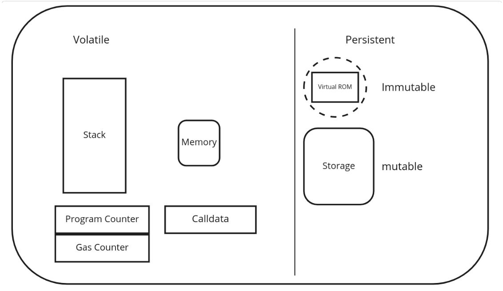

#### Data availability (DA)
Possible solutions are:
- DA Sampling (DAS). Each node downloads a small random subset of the total data and thus confirms that the data is available.
- DA Committees (DACs) are trusted parties that provide data and ensure DA. Ethereum, for example, uses a random subset of validators to attest to DA for light nodes.
- (Proto) Danksharding (EIP-4844, in progress)

EIP-4844 introduces a new Ethereum transaction type that holds a special field named *blob* and can hold about 125 kB data in size. Blobs will be committed with the KZG commitment scheme and are only available on the Beacon chain. It won't keep the data forever, only 1-3 months, to allow people to run nodes more efficiently. I read about it some time ago.

L2s can greatly benefit from Proto-Danksharding and reduce their fees by 10-100 times.

#### Hash functions
They are quite common in the modern world, and you probably know about it. Hash functions, like SHA256, produce a deterministic digest from some input. What is interesting is that there are hash functions that are more ZK-friendly than others. For example, Poseidon. See benchmarks of popular functions in Circom: https://eprint.iacr.org/2023/681.pdf

What else do we have from cryptography:
- (Fully) Homomorphic Encryption
- Verifiable Random Functions (VRFs) to get some pseudorandom outputs
- Verifiable Delay Functions (VDFs) to show that some time or computation has happened

#### Numbers and terminology
- Integers Z
- Rational numbers Q
- Real numbers R
- Fields (F or K)
- Modular arithmetic
- Group Theory

Check out one of my posts: https://hey.xyz/posts/0x8218-0x0280-DA-b047fd5f

## Day 4
### Math and Cryptography
Today, we continued the previous talk about the underlying math, perhaps the most challenging part of ZKP.

Two good resources:
https://www.rareskills.io/post/set-theory
https://www.khanacademy.org/computing/computer-science/cryptography/modarithmetic/a/what-is-modular-arithmetic

Also, check out one of my previous posts:
https://hey.xyz/posts/0x8218-0x0280-DA-b047fd5f

Most of the topics about groups and sets discussed are described in the articles above, and I don't see the point in rewriting all the concepts.

Interesting quote from Vitalik Buterin about polynomials:
> "There are many things that are fascinating about polynomials. But here we are going to zoom in on a particular one: polynomials are a single mathematical object that can contain an unbounded amount of information (think of them as a list of integers and this is obvious)."

Schwartz-Zippel Lemma: "different polynomials are different at most points" (but not all). For example, two polynomials of the degree 8 can intersect at no more than 8 points if they are not equal.

If you have some set of points (e.g. {1, 3}, {6, 10}, {8, 0}) then doing a Lagrange interpolation on those points gives you a polynomial that passes through all of those points.
Try it: https://www.wolframalpha.com/input?i=interpolating+polynomial+%7B1%2C+3%7D%2C+%7B6%2C+10%7D%2C+%7B8%2C+0%7D

We can represent polynomials in two forms:
1. Coefficient form
2. Point value form

Complexity theory studies the time or space requirements to solve problems based on input size. Problems can be classified based on the time required to find a solution, and the time needed grows with the size of the input n.

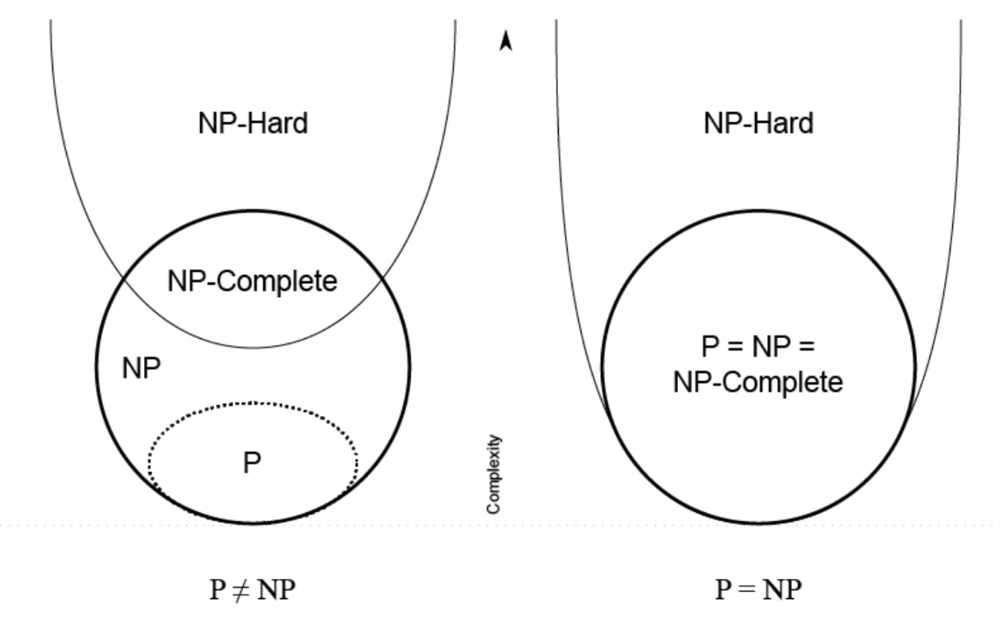

"Everything provable is provable in zero knowledge" (careful, very long paper):
https://dl.acm.org/doi/pdf/10.5555/88314.88333

Big O describes the complexity of some code using algebraic terms.

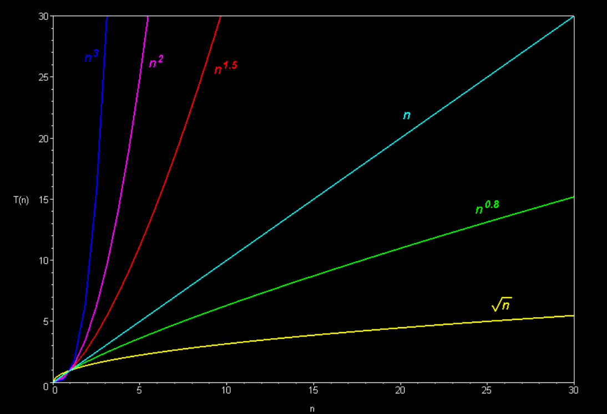

#### Zero Knowledge Proof
Comparison of different ZKP systems:

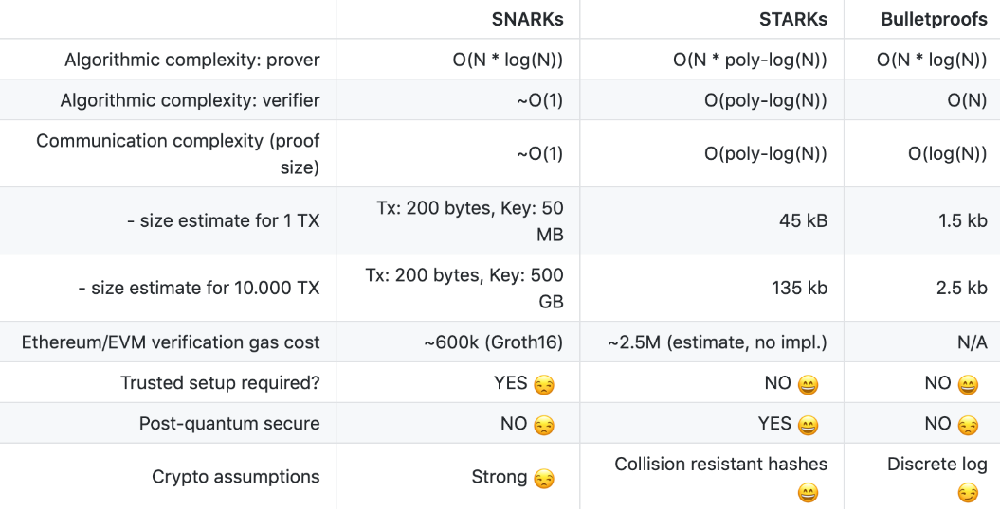

Check out another post of mine: https://hey.xyz/posts/0x8218-0x02a1

Non-interactivity can enable multiple verifiers to verify a proof without querying the prover.
Succinctness is only necessary if storing proofs is costly or verification time is critical.
A proof of knowledge is more valuable than a simple true statement proof.
In a proof, soundness holds against an unbounded prover, and in an argument, only against a polynomially-bounded prover.

## Day 5
### Rust
In the first part of the lesson, we've covered some common topics like Cargo, enums, `match`, `Option`, etc., in Rust synaxis, which you can find in any popular guide.

Rust is a very popular language in the ZKP space, because of its core features:
- Memory safety without garbage collection
- Concurrency without data races
- Abstraction without overhead

Check these two books to learn Rust:
https://google.github.io/comprehensive-rust/
https://doc.rust-lang.org/book

Many projects like StarkNet and Aztec use Rust-like languages to program smart contracts (circuits).

### Understanding and Analyzing Layer 2
How we differentiate L2s (from https://ethereum.org/en/layer-2/):
- Generalized like Arbitrum, Optimism, and StarkNet, which are EVM-complete, and you can run the same things as on Ethereum.
- Application specific like dYdX, Immutable, and Loopring that have some limitations in the possible instructions.

Check out more on L2Beat: https://l2beat.com/scaling/summary
*(and donate on GitCoin, they're good guys!)*

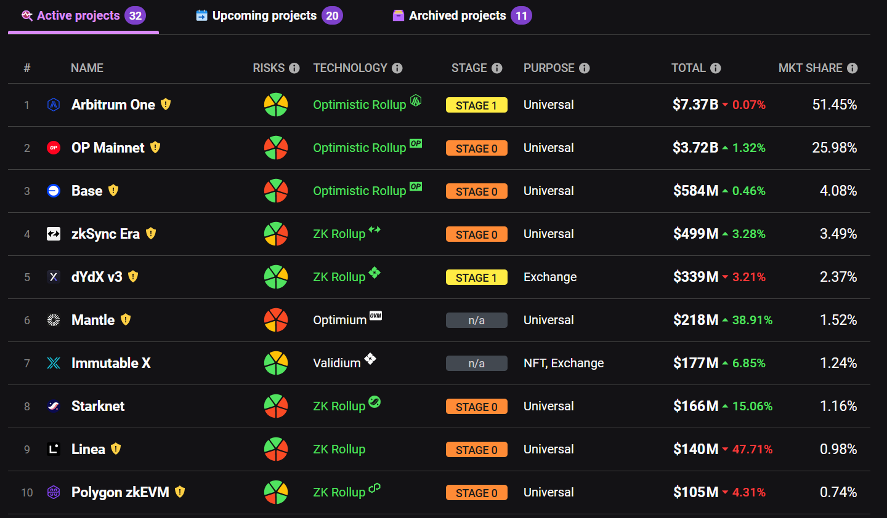

Back in 2020, we ran monolithic rollups but later realized they could be separated into several layers:

Check each layer here: https://stack.optimism.io/docs/understand/landscape/

- We usually use Ethereum to store data for DA because it has established security, but we're not limited in this regard. We can use a different storage, but it'll have other security assumptions.
- The Sequencing layer defines the collection of user transactions and their publication to the DA layer.
- The Derivation layer works very close to the DA layer and processes data to define the inputs for the Execution layer.
- The Execution layer takes inputs from the Derivation layer and processes outputs by some rules (for example, EVM opcodes).
- The Settlement layer is read-only and used by external parties to retrieve some data from the L2 blockchain. Usually, we have a Sequencer that collects the transactions by some API.

Vitalik Buterin introduced rollup milestones in this post: https://ethereum-magicians.org/t/proposed-milestones-for-rollups-taking-off-training-wheels/11571

- Stage 0: full training wheels
- Stage 1: limited training wheels
- Stage 2: no training wheels

Where 0 is the most centralized and unsecure stage, and 2 is the most decentralized and secure.

Also, check out a post by L2Beat: https://medium.com/l2beat/introducing-stages-a-framework-to-evaluate-rollups-maturity-d290bb22befe

Currently, there are only two rollups on Stage 2 (Fuel and DeGate), and the most popular ones are still on Stage 0.

## Day 6
### Agnostic Layer 2 Transaction Lifecycle
More Rust things like traits, generics, vectors, iterators, and shadowing.

On the previous day, we concentrated on OP Stack, but it is only fair to mention ZK Stack by zkSync and Madara by StarkNet:
https://blog.matter-labs.io/introducing-the-zk-stack-c24240c2532a
https://starkware.co/resource/harnessing-the-beast-madara-and-the-revolution-of-starknet-appchains/

Generally speaking, L2s follow a similar design.
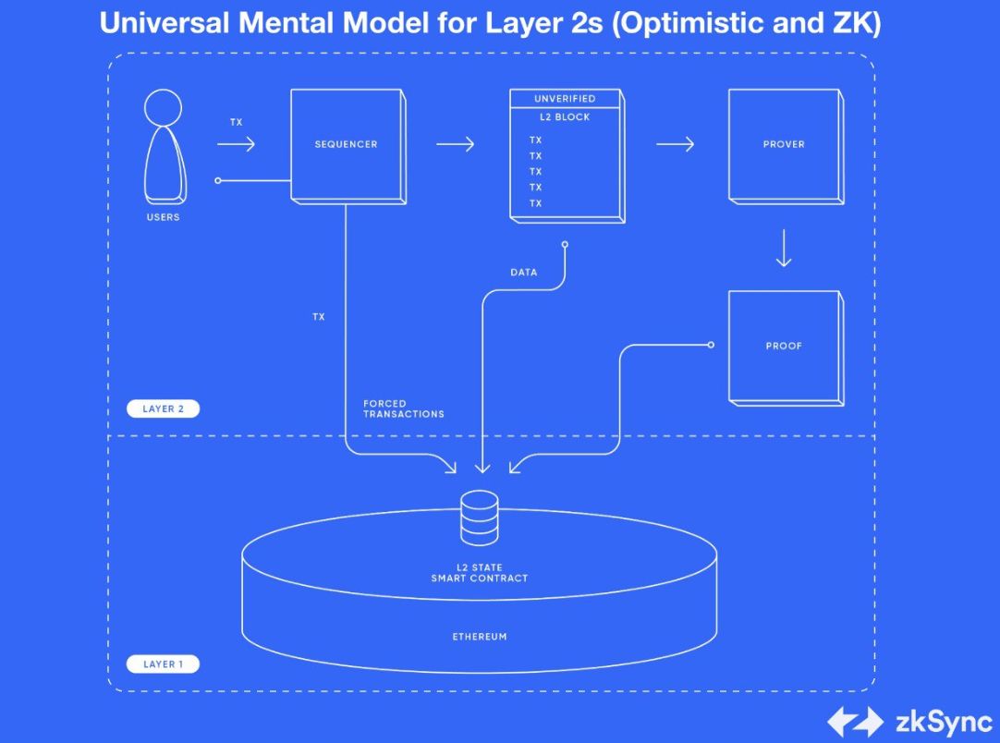

As you can see, Users send their transactions to the Sequencer, which executes these, batch, compresses, and submits to L1. The final component is an L1 smart contract that verifies the outputs of the Sequencer.

Differences between ZKP and Optimistic visualized:
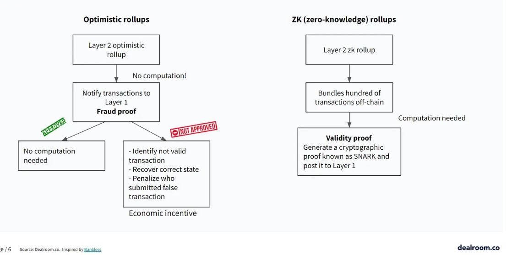

## Day 7
### Presentation by Patrick McCorry
Some structured info about fundamental fund management solutions in bridges, exchanges, etc.
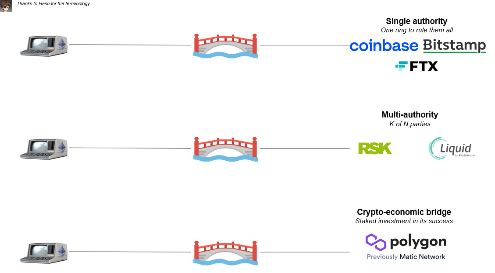

Several of the insights: how many funds were stolen from centralized systems, what were the reasons, and the history of the development of the trustless bridge solutions and rollups.

The incredible list of Bad Things: https://docs.google.com/spreadsheets/d/1ZEEAmXjpN8kL9BvITg9GKu-dbeUra6c14YLpLkCp5Zo

And I can't skip this fantastic Plasma map!
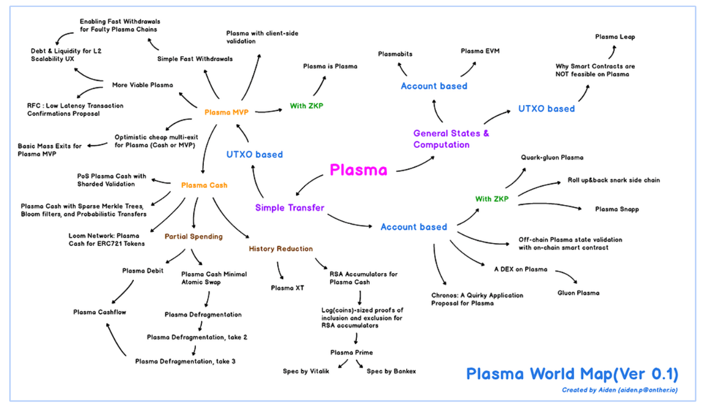

What was interesting from the speech was how tight rollups and bridges are actually bound. They have very similar mechanisms under the hood, though they work for different purposes.

The presentation escalated quickly, and we started to talk about how sequencers work in rollups. There are several parties in a typical rollup:
- Users
- Sequencer
- Executor

Sequencer waits for the transactions from Users and collects them with some ordering. Executor then takes this ordered list of transactions, executes it, and computes an updated state for some off-chain DB. It creates a checkpoint, and the process starts all over again.

There are several security issues in this scheme, though. Different rollups are trying to find their solutions to them.
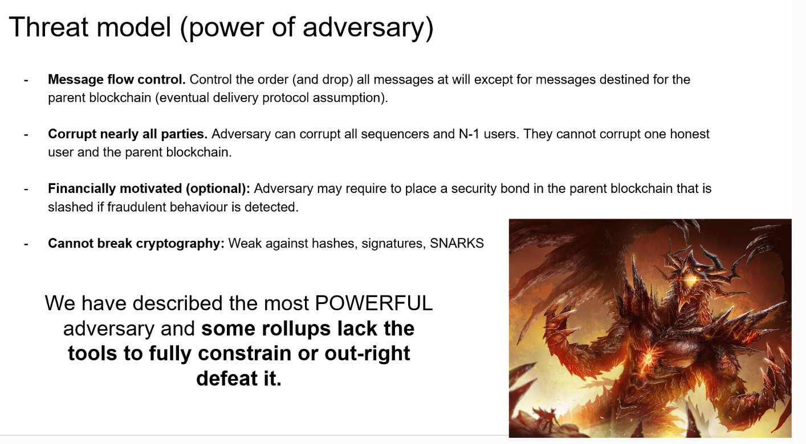

There's also the Data Availability problem. It was discussed in the previous lessons.

## Day 8
### SNARK overview
**S**uccinct **N**on-interactive **A**rgument of **K**nowledge

I think all the previous courses and guides developed a good sense of the term in my mind :) Now I can tell you what the abbreviation stands for without looking at Wikipedia!

Typical SNARK system is a triple of S(C), P(pp, x, w), and V(vp, x, π):
- S stands for Setup, it provides public parameters pp and vp
- P produces a short proof π for some circuit C based on the public parameters and some witnesses
- V is a function for verification of the proof based on public parameters

To be succinct, we require SNARK to be at least $`len(π) = Oλ (log (|C|))`$ in terms of the length of a proof and $`time(V ) = Oλ (|x|, log (|C|))`$ in terms of the verification time. This means the proof must be short and quick to verify.

The setup phase was actually a part of the verification, but some reasonable minds decided it could be extracted and put separately. This is what I've understood from the podcasts in the homework, at least (listen to them; they're really good).

Different kinds of SNARKs:
- Non-universal with separate setup per circuit and large **C**ommon **R**eference **S**tring (CRS); Groth16, for example;
- Universal with only one setup and smaller CRS like PLONK;
- Transparent with no need for setup and the smallest CRS like STARK.

The last one seems like an obvious choice, but universality or transparency comes with a big drawback in the form of worse proof size and verification time, and these two parameters are essential. 

General process of SNARK system creation:
1. Write a program in DSL (Kairo, Noir) or other language (Rust libraries)
2. Represent it as an arithmetic circuit (R1CS)
3. Convert it to a polynomial or some kind of relation that acts similar
4. Make it non-interactive

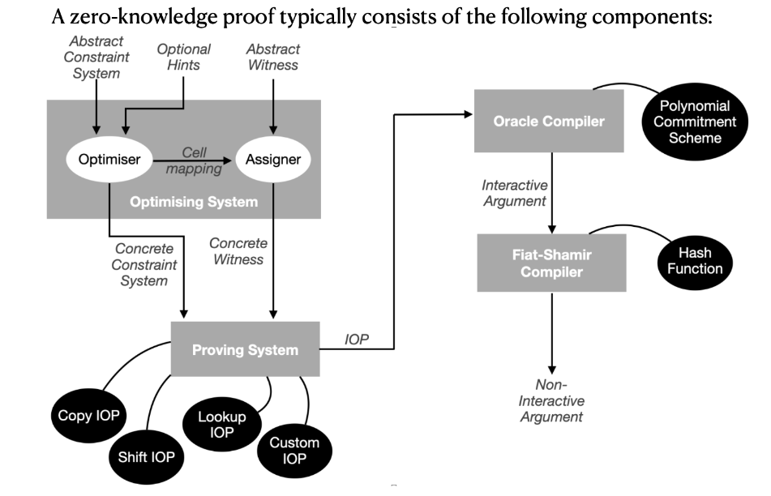

